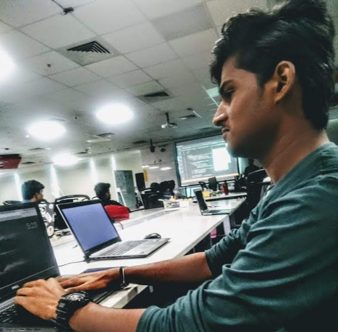

## Hi there, I'm Gokul Varadan
### Full Stack Designer and Developer

#### 💻 About Me
* 😎 AI/ML Learner and Open Source Enthusiast.
* 🤩 Specialized in Web and Mobile Technologies.
* ✒️ Expertized in Graphic Designer and UI/UX Specialist.
* 💡 Exploring new technologies and Quick hacks.

#### ⚙️ Tech Stack
* Web Technologies including Reactjs | Nodejs |Python | Golang.
* Familiar with Tensorflow, Pytorch DL Frameworks
* MySql, Mongodb, PostgresQL
* Illustrator, Photoshop, Premeire Pro, After Effects
 

#### 🤝🏻 Connect with Me

